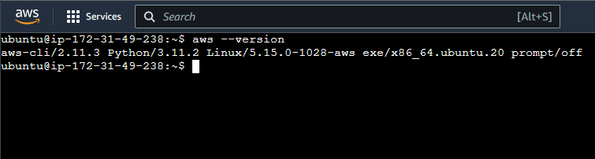
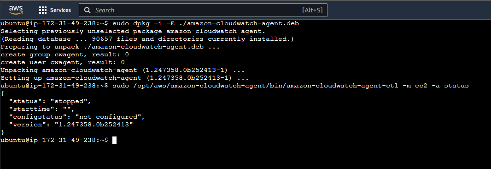
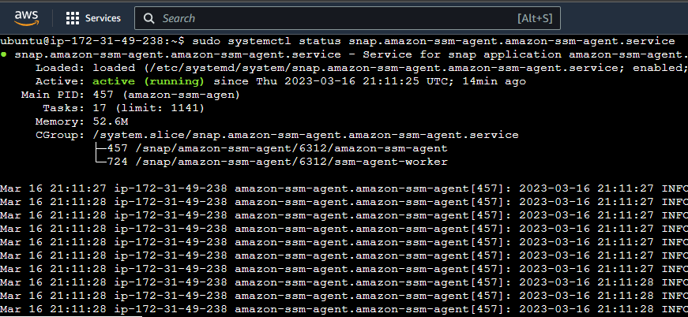
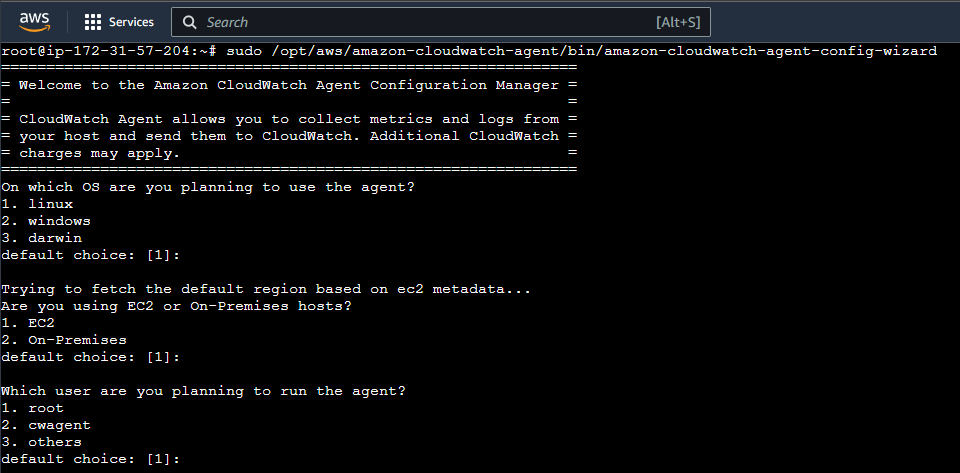
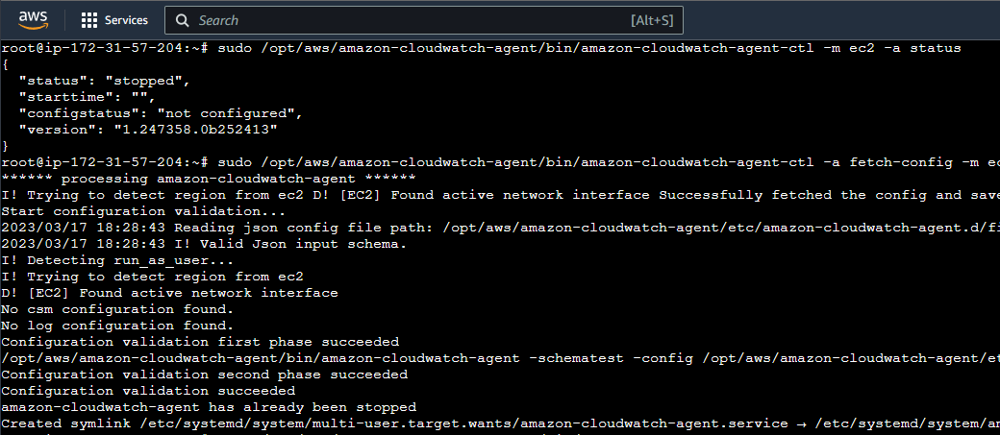
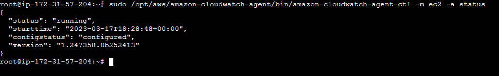
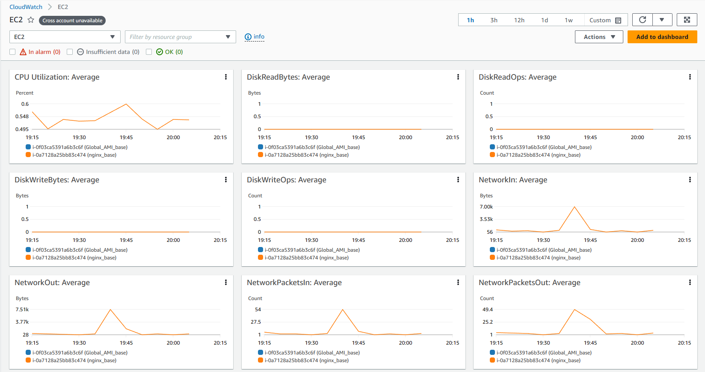
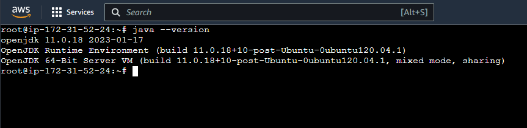
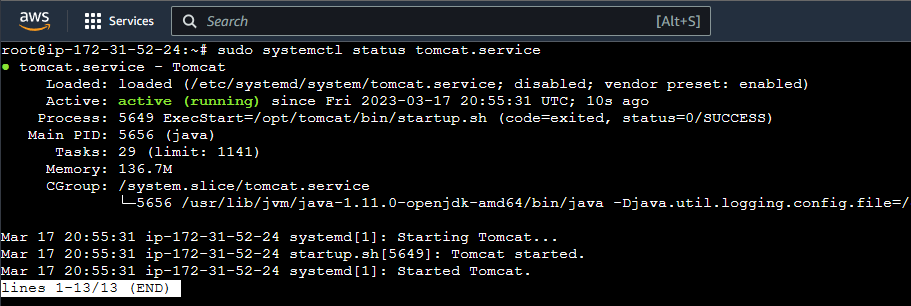

# Phase 1 - Pre-Deployment
In this phase, we will create the EC2 instances and create Global and Golden AMIs.

## Pre-Deployment

### Create Golden AMI
A Golden AMI is a modified image created from a base AMI EC2 instance after installing required patches, updates and so>instances which will then include all the updates and changes made by the user. 

#### Create IAM Role

To install and use CloudWatch Agent, we will first need to enable a Role with a suitable policy before we initiate the EC2 instance.

1. Go to the IAM dashboard and click on '**Roles**'
2. Click on '**Create Role**'
3. In 'Trusted Entity Type', select '**AWS service**'
4. In the 'Use Case' section, under 'Common uses cases', select '**EC2**' and click next.
5. Search for and select '**CloudWatchAgentServerPolicy**'
6. Name your role as *CloudWatchAgentServerRole*

Now we can create our EC2 instance.

#### Launch EC2 Instance

From the EC2 console, launch a new EC2 instance. We are using an Ubuntu 20.04 AMI to do this. Once the instance is launched and running, we will attach an IAM role to it.

1. Select the EC2 instance
2. In the top right corner, go to Actions -> Security -> Modify IAM Role
3. From the dropdown, select the role we just created above, '**CloudWatchAgentServerRole**'
4. Click on Update Role.

#### Install AWS CLI

Before jumping ahead in installing AWS CLI, we will need to install 'unzip'. This will be used to unzip the official AWS CLI package.

```bash
sudo apt install unzip
```

We are using the official AWS [documentation](https://docs.aws.amazon.com/cli/latest/userguide/getting-started-install.html) to install AWS CLI. This method uses a download, extract and install procedure (which is why we installed unzip first).

 Once the process has completed, you can check the AWS version using

```bash
aws --version
```



#### Install AWS CloudWatch Agent

The next step is to install the AWS CloudWatch Agent. This is where we will push all of our custom memory metrics.

```bash
wget https://s3.amazonaws.com/amazoncloudwatch-agent/ubuntu/amd64/latest/amazon-cloudwatch-agent.deb

sudo dpkg -i -E ./amazon-cloudwatch-agent.deb
```

This will install the CloudWatch Agent. You need to check if it is running or not. In our case, after installing, it did not run automatically.

```bash
sudo /opt/aws/amazon-cloudwatch-agent/bin/amazon-cloudwatch-agent-ctl -m ec2 -a status
```



If it's running for you, move on. If not, then start the agent.

```bash
sudo /opt/aws/amazon-cloudwatch-agent/bin/amazon-cloudwatch-agent-ctl -a fetch-config -m ec2 -s -c ssm:configuration-parameter-store-name
```

#### Install AWS SSM Agent

First, we need to check if the SSM agent is pre-installed or not. As per the [AWS docs](https://docs.aws.amazon.com/systems-manager/latest/userguide/ami-preinstalled-agent.html), it should come pre-installed with our version of Ubuntu. Let's verify this

```bash
sudo systemctl status snap.amazon-ssm-agent.amazon-ssm-agent.service
```



Once all these steps are finished, we are ready to create our Image from this instance.

1. In the EC2 dashboard, select the instance.
2. In the top right corner, click on Actions -> Image & Templates -> Create Image
3. Use any name you like. We will use '**Global_AMI**'
4. Keep all the default options and create the image.
5. In the left navigation, go to AMIs and you should see your newly created AMI.

> Note: It may take a while to be fully created. It will be in a '*pending*' state initially.

Now, every time you use this AMI to create an instance, it will come pre-installed with AWS CLI, CloudWatchAgent and SSM.

### Create Golden AMI for NGINX

You can alternatively simply create an EC2 instance and install NGINX on it, if you do not wish to create an NGINX specific AMI.

To install NGINX on the instance

```bash
sudo apt install -y nginx
```

Verify if the NGINX service is started and running.

```bash
sudo systemctl status nginx.service
```

#### Configure CloudWatchAgent for Metrics

Once our NGINX instance is ready, we will configure the CWA to start sending metrics.

```bash
sudo /opt/aws/amazon-cloudwatch-agent/bin/amazon-cloudwatch-agent-config-wizard
```



You can keep most of the values in this wizard to defaults, however, select '**No**' for the following:

1. Do you want to monitor metrics from CollectD? -> No
2. Do you want to monitor any log files? -> No
3. Do you want to store the config files in the SSM parameter store? -> No

The options which you could change could be to say no to selecting log files. When prompted to store the config in the SSM Parameter store, select No. This means we are storing the config file locally. You can find the config file at this location:

```bash
/opt/aws/amazon-cloudwatch-agent/bin/config.json
```

Now, we have to start the CW Agent using the config file generated from the wizard.

```bash
sudo /opt/aws/amazon-cloudwatch-agent/bin/amazon-cloudwatch-agent-ctl -a fetch-config -m ec2 -s -c file:/opt/aws/amazon-cloudwatch-agent/bin/config.json
```



Finally, we can see that our CW Agent has started



And here is CloudWatch logging our metrics



### Create Golden AMI for Apache Tomcat

This Golden AMI will have Tomcat and all the dependencies installed and configured.

#### User Setup

It is recommended to run Tomcat as a separate non-privileged user. We will create a user named 'tomcat' so that the service can be run as that user.

```bash
sudo useradd -m -d /opt/tomcat -U -s /bin/false tomcat
```

> Note: Here, when we supply the `/bin/false` file, we ensure that it is not possible to log in as the user 'tomcat' on to the Ubuntu machine.

#### Install JDK 11

Since Tomcat is a Java web server, we need to install JDK first.

```bash
sudo apt install default-jdk
```

> Note: On Ubuntu 20.04 (which we are using), this will install JDK 11.

Verify the java installation.

```bash
java --version
```



#### Install Tomcat

To install Tomcat, we will have to download the binary.

```bash
# Change to /tmp folder
cd /tmp

# Download binary
wget https://dlcdn.apache.org/tomcat/tomcat-10/v10.1.7/bin/apache-tomcat-10.1.7.tar.gz
```

Now, we extract the downloaded file

```bash
sudo tar xzvf apache-tomcat-10*tar.gz -C /opt/tomcat --strip-components=1
```

We will give ownership of these files to the 'tomat' user that we created earlier.

```bash
sudo chown -R tomcat:tomcat /opt/tomcat/
sudo chmod -R u+x /opt/tomcat/bin
```

Now, we will create a `systemd` service for Tomcat. This ensures that Tomcat keeps quietly running in the  background and in case of a system restart, is started automatically. First, we need to get the Java runtime path.

```bash
sudo update-java-alternatives -l

# Output
java-1.11.0-openjdk-amd64	1111	/usr/lib/jvm/java-1.11.0-openjdk-amd64
```

The path in the third column is what we need.

To create the 'systemd' service, we have to create a file named `tomcat.service` under `/etc/systemd/system`

```bash
sudo nano /etc/systemd/system/tomcat.service
```

In the editor, paste this text

```ini
[Unit]
Description=Tomcat
After=network.target

[Service]
Type=forking

User=tomcat
Group=tomcat

Environment="JAVA_HOME=/usr/lib/jvm/java-1.11.0-openjdk-amd64"
Environment="JAVA_OPTS=-Djava.security.egd=file:///dev/urandom"
Environment="CATALINA_BASE=/opt/tomcat"
Environment="CATALINA_HOME=/opt/tomcat"
Environment="CATALINA_PID=/opt/tomcat/temp/tomcat.pid"
Environment="CATALINA_OPTS=-Xms512M -Xmx1024M -server -XX:+UseParallelGC"

ExecStart=/opt/tomcat/bin/startup.sh
ExecStop=/opt/tomcat/bin/shutdown.sh

RestartSec=10
Restart=always

[Install]
WantedBy=multi-user.target
```

Reload the `systemd` daemon to refresh it with the new service.

```bash
sudo systemctl daemon-reload
```

Finally, we start the Tomcat service

```bash
sudo systemctl start tomcat
```

Your Tomcat service should now be running. To verify

```bash
sudo systemctl status tomcat.service
```



To make Tomcat run automatically upon system restart

```bash
sudo systemctl enable tomcat
```

#### Push custom memory metrics to CloudWatch Agent

You can follow the same steps listed above in the NGINX creation to finish this step.

### Create Golden AMI for Apache Maven Build Tool
We will now create an EC2 instance that will act as our Maven Build base.

#### Install Git

It is most likely that Git will be pre-installed. It comes pre-installed with Ubuntu 20.04, however it may not be the latest version. This should not be a problem.

```bash
git --version
```

#### Install JDK 11

Maven works on Java so, like earlier, we will need to install JDK. Follow the same steps we used earlier to install JDK 11

#### Install Maven

Maven is a software that will help us 'build' our Java app to be ready to be published to the internet.

```bash
sudo apt install -y maven
```

To verify the installation,

```bash
mvn -version
```

We have to set up the Environment variables for Maven so the system can find it and execute it.

```bash
sudo nano /etc/profile.d/maven.sh
```

Add the following code to this file

```ini
export JAVA_HOME=/usr/lib/jvm/java-11-openjdk-amd64
export M2_HOME=/opt/maven
export MAVEN_HOME=/opt/maven
export PATH=${M2_HOME}/bin:${PATH}
```

---

[Phase 2- Networking Setup](/docs/2-networking-setup.md)

